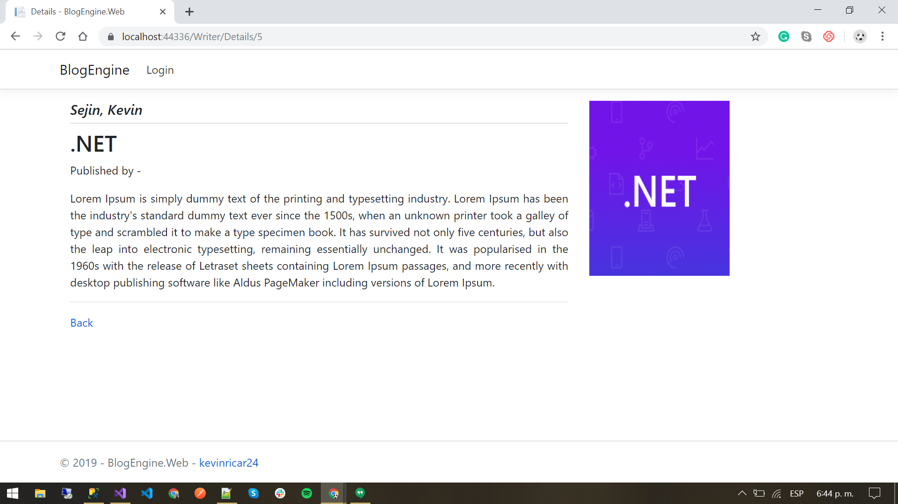
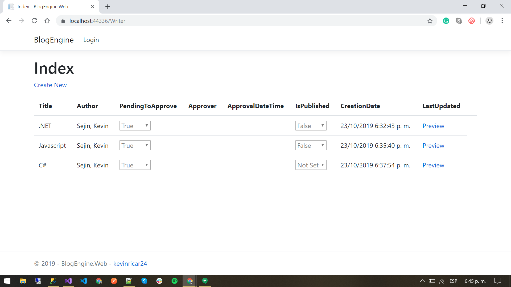
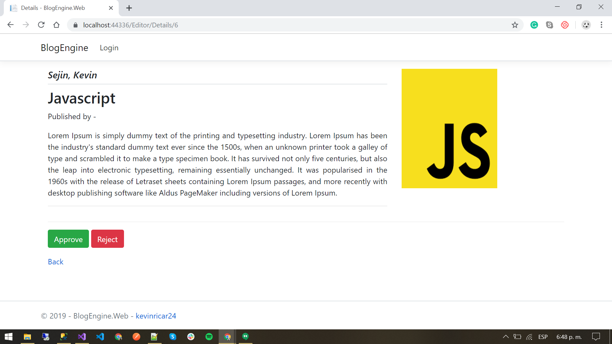
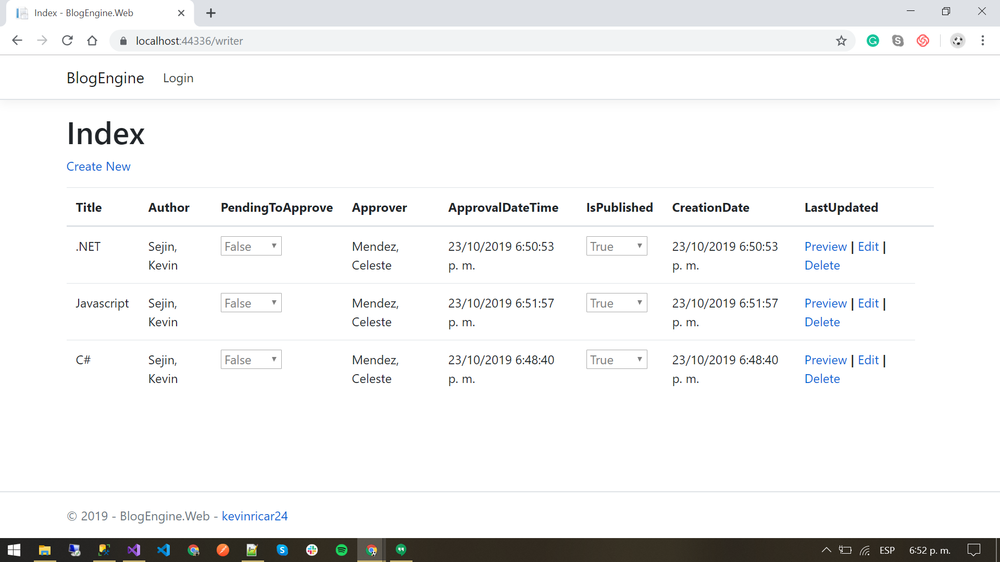
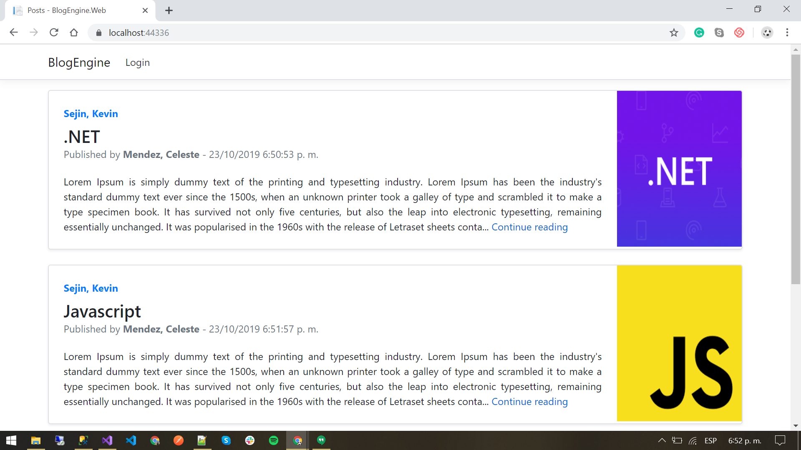

# BlogEngine

Requirements:

- netcoreapp3.0
- Microsoft.EntityFrameworkCore.Design 				Version="3.0.0"
- Microsoft.EntityFrameworkCore.SqlServer 			Version="3.0.0"
- Microsoft.EntityFrameworkCore.Tools 				Version="3.0.0"
- Microsoft.EntityFrameworkCore 					Version="3.0.0"
- Microsoft.Extensions.Logging.Debug 				Version="3.0.0"
- Microsoft.VisualStudio.Web.CodeGeneration.Design  Version="3.0.0"

# ASP.NET Core Web Application

- BlogEngine.Database
- BlogEngine.BusinessLogic
- BlogEngine.DataAccessLayer
- BlogEngine.Web

# Steps to run the Application

1) Execute the script BlogEngineSchemaData.sql located in BlogEngine.Database\Script
2) Execute the project BlogEngine.Web (please Set as StartUp Project )
3) to create posts use the Writer user
   - Go to Login and use this credentials (user and password) : userwriter
   - Create posts in draft status or sent to publish
4) to approve posts use the Editor user
   - Go to Login and use this credentials (user and password) : usereditor
   - Publish the posts pending to approve
5) Go to Home Page to view all posts published
6) Entry in the detail of each post in the link "Continue Reading"
7) Add Comment in the post

